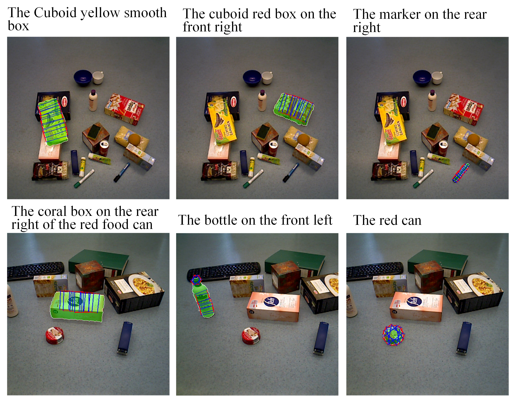

# CTNet
### Dataset:
Our RefOCIDGrasp annotation: [Google Drive](https://drive.google.com/drive/folders/1tKdB7tIugG3hKUOCYzxjNajqSqnk6Wo0?usp=drive_link)



```
-data (folder)
----ref-OCID-Grasp (our annotation)
--------train_expressions.json
--------test_expressions.json
--------val_expressions.json

----OCID_grasp (from https://github.com/stefan-ainetter/grasp_det_seg_cnn)
--------ARID10
--------ARID20

-dataset
----referRGBDDataset.py
```


#### Related datasets
OCID: [URL](https://www.acin.tuwien.ac.at/en/vision-for-robotics/software-tools/object-clutter-indoor-dataset/)

RefOCID: [Github](https://github.com/lluma/OCID-Ref)

OCIDGrasp: [Github](https://github.com/stefan-ainetter/grasp_det_seg_cnn)
### More details will be released soon...
